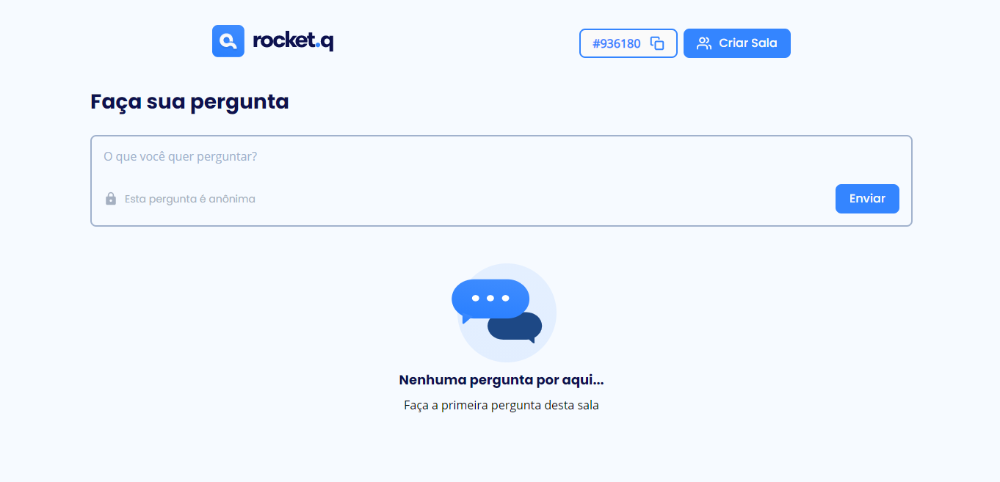
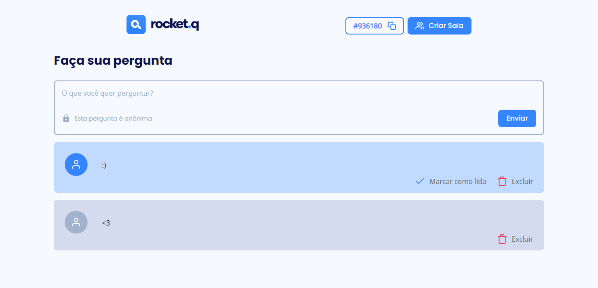
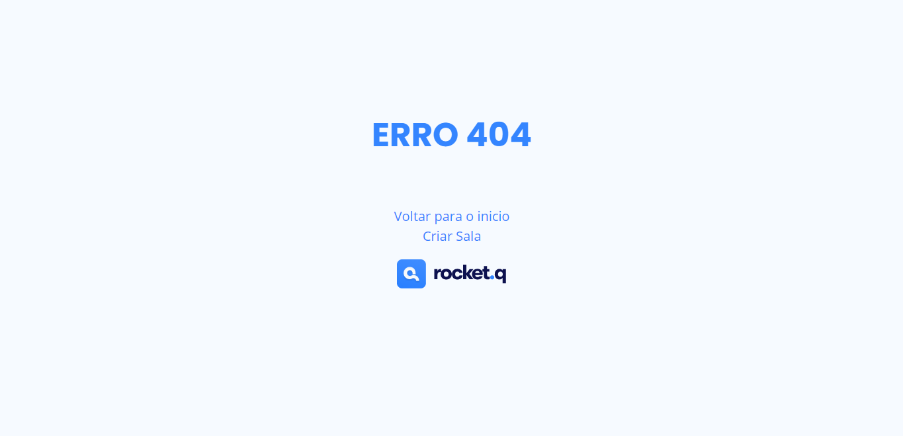

<style>
    @import url("https://fonts.googleapis.com/css2?family=Open+Sans&family=Poppins:wght@500;600;700&display=swap");
    font {
        font-weight: 600;
        font-family: 'Poppins';
    }
</style>

# <font>Rocket.Q</font>

## Neste Projeto você pode criar salas ou entrar em uma e fazer perguntas exlcuir marcar como lida


## Caso você queira rodar esse projeto no seu pc é só executar esses comandos no terminal do vscode ou qualquer outro

##

## Você precisa ter o npm ou yarn instalados e o git

```
git clone https://github.com/jorge933/rocket.q.git
```

```
npm install
```

## <font>Ok agora só falta criar o banco de dados</font>

```
npm run db-init
```

## <font>Agora é só inciar o projeto</font>

```
npm start
```

### <font>Home</font>


### <font>Criar Salas</font>


### <font>Sala sem perguntas</font>




### <font>Sala com uma pergunta não lida e uma lida</font>



## <font>404</font>

